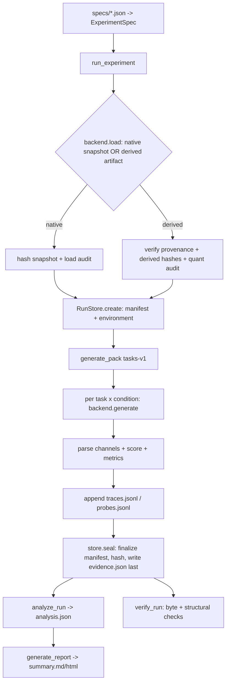

# Architecture

This document describes how PonderScope is actually implemented. Every diagram
and path below corresponds to real code.

## Layered scientific identity

Identity is deliberately layered so unrelated provenance cannot silently change
what is measured (`src/ponderscope/config/identity.py`):

```
SourceArtifactIdentity   repo_id + immutable revision + source
                         weight/tokenizer/chat-template hashes      -> src-…
        │  (lineage: derived_from_source_artifact_id)
WeightVariantIdentity    original | derived; variant weight hashes;
                         precision/quantization; conversion params    -> wvar-…
        │  (+ RuntimeIdentity: runtime/version/backend/hardware/os)
DeploymentIdentity       weight variant + runtime                     -> dep-…
ConditionIdentity        decoding policy (NO seed)                    -> cond-…
TrialIdentity            presentation + condition + seed + repeat     -> trial-…
StochasticDrawIdentity   presentation + condition + seed (no repeat)  -> draw-…
```

A backend-specific **load audit** and any **local path** are excluded from
scientific identity. `presentation_id` is structural task id + prompt policy +
sha256 of the rendered prompt, so a prompt-policy change cannot collide with a
deployment contrast.

## Experiment lifecycle



Raw evidence is create-once and atomic (`evidence/store.py`). `seal()` finalizes
the manifest, writes it, then hashes the final manifest and all raw evidence, and
writes `evidence.json` last (`evidence/run.py`).

## Model execution path

`backends/mlx_backend.py` is the only real backend.

- `resolve_local_snapshot` locates an immutable revision in the HF cache; it
  never downloads a different revision.
- `load` loads native weights (`strict=False`, audited) or, with
  `artifact_path`, a derived variant whose provenance is verified first.
- `generate` calls `mlx_lm.generate_step` with an explicit `make_sampler` and
  logits processors. The captured per-token logprob vector is the pre-sampler
  distribution **after** logits processors and **before** temperature/top-p/top-k
  filtering.
- Presence penalty has two explicit semantics: MLX-LM's built-in rolling
  prompt-inclusive window (`mlx_window`) and PonderScope's generated-history
  penalty (`generated_history`, prompt excluded, no rolling window), implemented
  in `backends/processors.py`.

## Reasoning channels and termination states

`reasoning/parse.py` splits a generation at token boundaries: reasoning tokens
are those strictly before the native think-end id; final tokens are after it.
`reasoning/transitions.py` classifies:

- **prefix states** over observed forced probes only;
- **natural final status** ∈ `correct`, `incorrect`, `censored`,
  `terminated_no_closure`, `unparseable`, `error`;
- **sufficiency** with and without a required observed natural final.

A censored trajectory contributes no correctness transition and can never be
evidence of harmful overthinking.

## Analysis and statistics

`analysis/draws.py` collapses same-seed technical repeats to one stochastic draw
iff token-identical, flagging divergent draws as ambiguous and excluding them
from primary summaries. `analysis/survival.py` implements Kaplan–Meier and RMST
directly (no SciPy/lifelines). `analysis/stats.py` performs task-clustered
bootstraps. `analysis/compare.py` classifies a contrast by hypothesis, refuses
confounded comparisons, and reports censor-aware RMST deltas. `analysis/report.py`
renders Markdown/HTML from saved evidence only.

## Conversion and provenance

`conversion.py` wraps `mlx_lm.convert.convert` with a storage guard, create-once
output, source-identity hashing, and a `ponderscope_variant.json` record
(requested params, tool version, **actual** per-module quantization scheme,
derived hashes, tokenizer think/EOS ids). Local paths are stored outside the
identity-bearing `conversion` field. `variant-audit` performs a real load and
short generation to validate tokenizer semantics and the reasoning channel.
